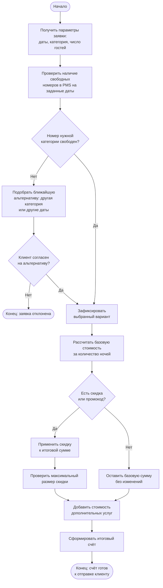

# Flowchart — алгоритм «Проверка наличия номеров и расчёт стоимости бронирования»

Блок-схема детализирует шаги 3–5 бизнес-процесса: проверку свободных номеров,
подбор альтернативы при их отсутствии и расчёт итоговой стоимости проживания.

