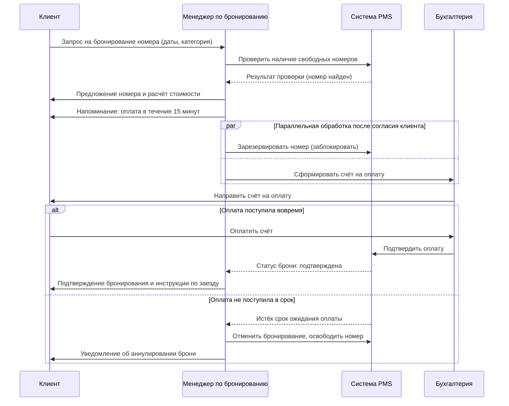

# Sequence Diagram — сценарий «Бронирование номера с успешной и неуспешной оплатой»

Диаграмма показывает обмен сообщениями между клиентом, менеджером по бронированию,
системой управления отелем (PMS) и бухгалтерией на этапе оформления и оплаты брони.

