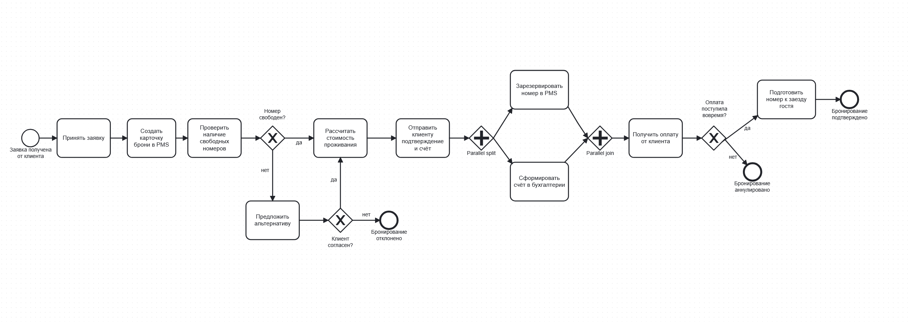
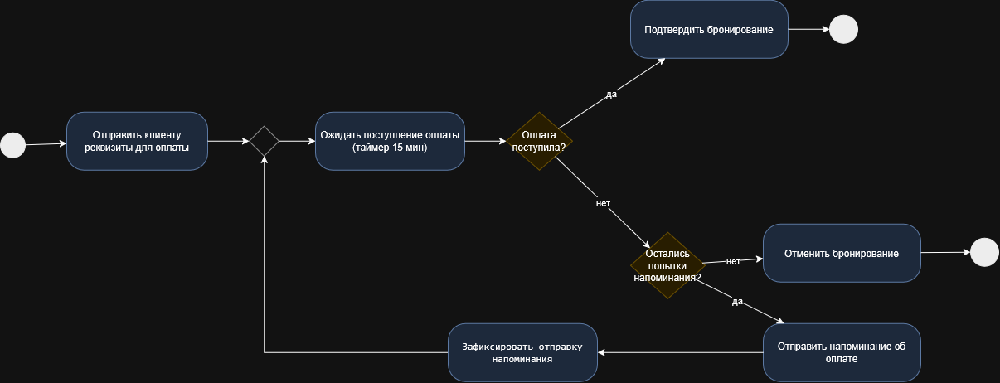
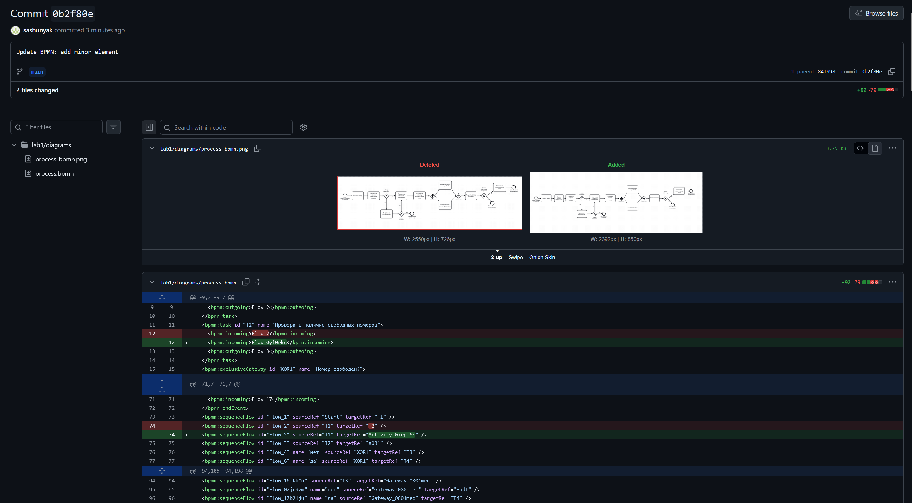
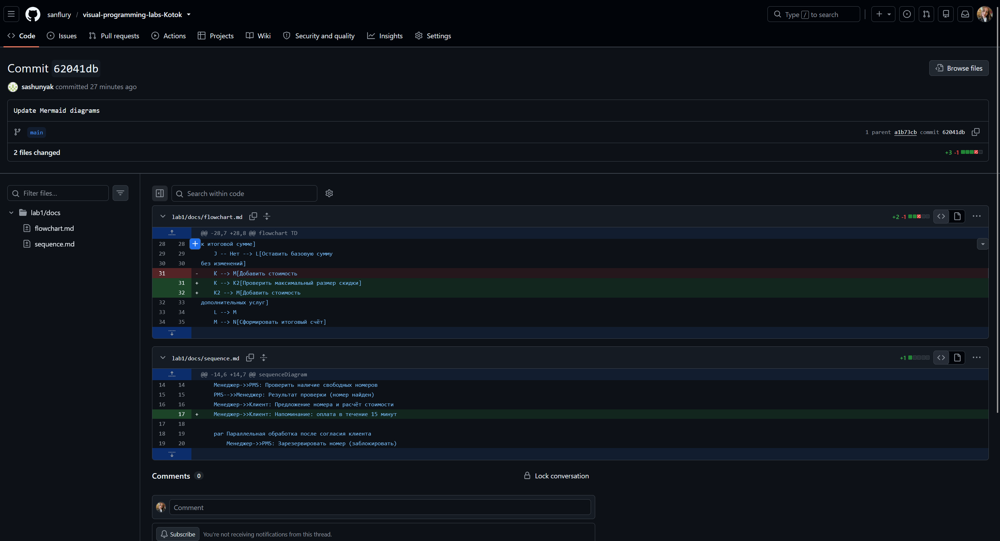

# Отчёт по лабораторной работе №1

## Краткое описание процесса

В качестве предметной области я выбрала процесс бронирования номера в отеле.
Клиент оставляет заявку, менеджер проверяет её параметры, а система управления
отелем (PMS) проверяет, есть ли свободный номер на нужные даты. Если номера нет —
клиенту предлагают альтернативу (другую категорию или другие даты), и если он
не согласен, заявка отклоняется. Если номер есть — система рассчитывает стоимость,
учитывает скидки и дополнительные услуги, формирует счёт.

После согласия клиента система параллельно резервирует номер в PMS и формирует
счёт в бухгалтерии. Клиенту даётся 15 минут на оплату. Если оплата не поступила,
отправляются напоминания (максимум 2 попытки). Если оплата поступила — бронь
подтверждается. Если нет — бронь автоматически аннулируется, а номер возвращается
в продажу.

## Диаграммы

**BPMN-диаграмма** — основной путь процесса бронирования от заявки до
подтверждения или отмены. Показаны все задачи, шлюзы и параллельные действия.

**UML Activity Diagram** — детализация шага «Получение оплаты». Здесь видно
ветвление и цикл напоминаний, а также два выхода: подтверждение брони или
её отмена.

**Sequence Diagram** — обмен сообщениями между клиентом, менеджером, PMS и
бухгалтерией при успешной и неуспешной оплате.

Ссылка: [sequence.md](docs/sequence.md)

**Flowchart** — алгоритм проверки свободных номеров и расчёта стоимости
проживания с учётом скидок и дополнительных услуг.

Ссылка: [flowchart.md](docs/flowchart.md)

## Diff

При внесении изменений в диаграммы я специально смотрела, как Git показывает
разницу между версиями файлов

На скриншоте видно:

- Для файла `process-bpmn.png` GitHub показывает просто «было / стало»
  двумя картинками
- Для файла `process.bpmn` GitHub показывает конкретные строки,
  которые изменились

Такую же проверку я делала для UML Activity (`.drawio` vs `.png`) и для
Mermaid-файлов (`.md`). Для markdown-файлов diff тоже виден построчно,
как и для BPMN

## Выводы

В ходе работы я настроила Git-репозиторий, разобралась с SSH-ключами и
освоила базовые команды Git. Также я
научилась представлять один и тот же бизнес-процесс в четырёх разных
нотациях — BPMN, UML Activity, Sequence Diagram и Flowchart